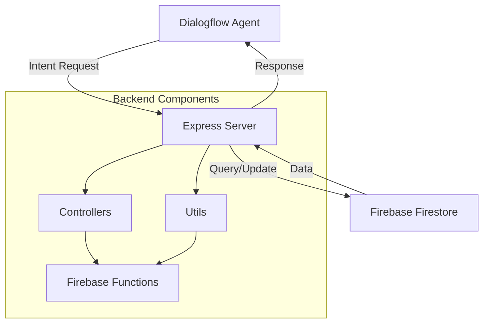

# 🤖 Dialogflow Restaurant Booking Backend 🍽️


## 📑 Table of Contents

- [Overview](#-overview)
- [Key Features](#-key-features)
- [System Architecture](#-system-architecture)
- [Installation](#-installation)
- [Environment Variables](#-environment-variables)
- [API Endpoints](#-api-endpoints)
- [Dialogflow Integration](#-dialogflow-integration)
- [Firebase Data Structure](#-firebase-data-structure)
- [Docker Deployment](#-docker-deployment)
- [Development](#-development)
- [License](#-license)

## 🌟 Overview

A powerful backend system designed to handle restaurant reservation management through Dialogflow conversational interfaces. This application serves as the webhook fulfillment service that processes intent requests from Dialogflow and manages restaurant bookings, availability checks, callbacks, and waitlist functionality using Firebase as the database.

## 🎯 Key Features

| Feature | Description |
|---------|-------------|
| 📅 Reservation Management | Complete booking lifecycle from creation to cancellation |
| ⏰ Availability Checking | Intelligent time slot availability verification |
| 📆 Working Hours Verification | Validates restaurant operating hours for booking requests |
| 🏖️ Holiday Management | Handles special dates and holidays when the restaurant is closed |
| 🎫 Special Events | Supports bookings for special events with custom requirements |
| 📝 Waitlist Management | Queue system for fully booked time slots |
| 📞 Callback Requests | Handles customer callback requests for manual booking |
| 🧩 Booking Modifications | Update or cancel existing reservations |

## 🏗️ System Architecture



## 🚀 Installation

1. **Clone the repository**
   ```bash
   git clone https://github.com/yourusername/Fiverr-Marcomichellaci-Dialogflow-Backend.git
   cd Fiverr-Marcomichellaci-Dialogflow-Backend
   ```

2. **Install dependencies**
   ```bash
   # Using npm
   npm install
   
   # Using pnpm (recommended)
   pnpm install
   ```

3. **Set up environment variables**
   ```bash
   cp .env.example .env
   # Edit .env with your configuration
   ```

4. **Build the project**
   ```bash
   pnpm build
   ```

5. **Start the server**
   ```bash
   pnpm start
   ```

## 🔐 Environment Variables

| Variable | Description | Example |
|----------|-------------|---------|
| PORT | Server port number | 8000 |
| API_KEY | API key for securing endpoints | secretapikey123 |
| FIREBASE_CREDENTIALS | Firebase service account JSON (stringified) | {"type": "service_account", ...} |

## 🌐 API Endpoints

| Endpoint | Method | Description |
|----------|--------|-------------|
| `/` | GET | Health check endpoint |
| `/dialogflow/webhook` | GET | Dialogflow webhook verification |
| `/dialogflow/webhook` | POST | Dialogflow fulfillment endpoint |

## 🔄 Dialogflow Integration

The backend handles various intents from Dialogflow through the tag mechanism:

| Intent Tag | Function | Description |
|------------|----------|-------------|
| defaultWelcomeIntent | defaultWelcomeIntent() | Handles welcome messages |
| checkWorkingHours | checkWorkingHours() | Verifies if restaurant is open |
| getFutureHolidays | getFutureHolidays() | Lists upcoming holiday closures |
| checkAvailableTables | checkAvailableTables() | Checks table availability |
| addToBookings | addToBookings() | Creates a new reservation |
| addToWaitingList | addToWaitingList() | Adds customer to waitlist |
| addToCallback | addToCallback() | Registers callback request |
| getBookingFromPhone | getBookingFromPhone() | Finds bookings by phone number |
| invalidateBookingDate | invalidateBookingDate() | Checks if booking date is valid |
| getReservationFromParameter | getReservationFromParameter() | Finds specific reservation |
| cancellReservation | cancellReservation() | Cancels an existing booking |
| updateBooking | updateBooking() | Modifies booking details |

## 📊 Firebase Data Structure

```
📂 test_restaurants
  ┣ 📄 restaurant1
  ┃  ┣ 📂 availability
  ┃  ┃  ┗ 📄 date: "YYYY-MM-DD"
  ┃  ┣ 📂 bookings
  ┃  ┃  ┗ 📄 bookingId
  ┃  ┣ 📂 waitingList
  ┃  ┃  ┗ 📄 waitingId
  ┃  ┗ 📂 callbackRequests
  ┃     ┗ 📄 callbackId
  ┗ 📄 restaurant2
     ┗ ...
```

## 🐳 Docker Deployment

This project includes a Dockerfile for easy containerization:

```bash
# Build Docker image
docker build -t dialogflow-restaurant-backend .

# Run container
docker run -p 8000:8000 \
  -e PORT=8000 \
  -e API_KEY=yourapikey \
  -e FIREBASE_CREDENTIALS='{"project_id":"..."}' \
  dialogflow-restaurant-backend
```

## 💻 Development

```bash
# Run in development mode with hot reloading
pnpm dev

# Build TypeScript files
pnpm build

# Run production server
pnpm start
```

## 📝 License

This project is licensed under the ISC License - see the LICENSE file for details.

---

Developed by [Raj Kapadia](https://github.com/RajKKapadia) ✨
